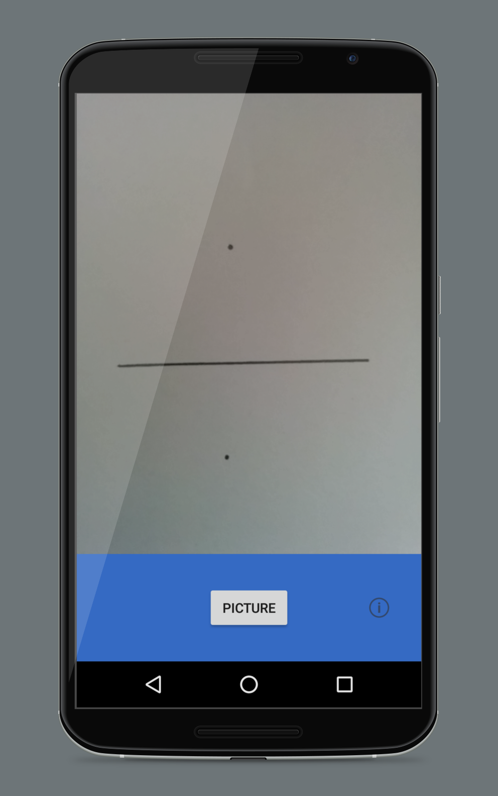
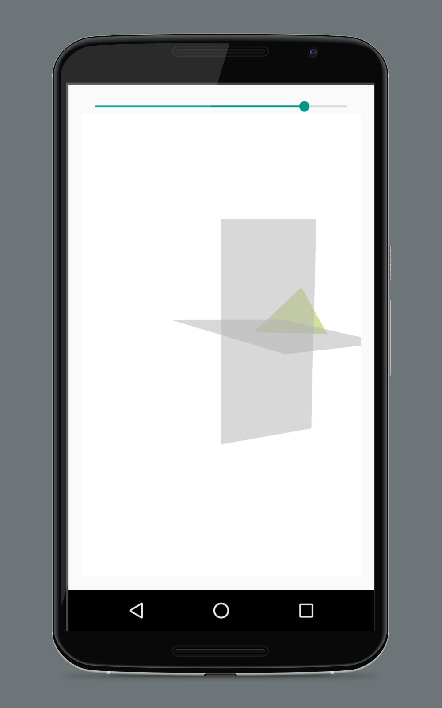
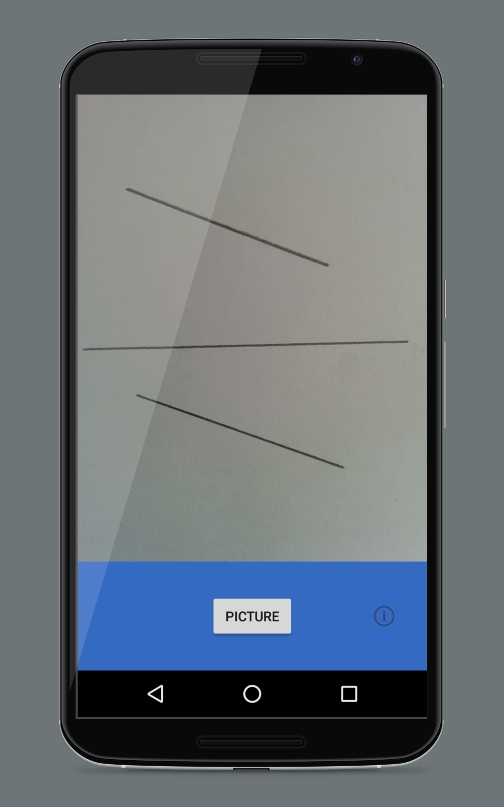
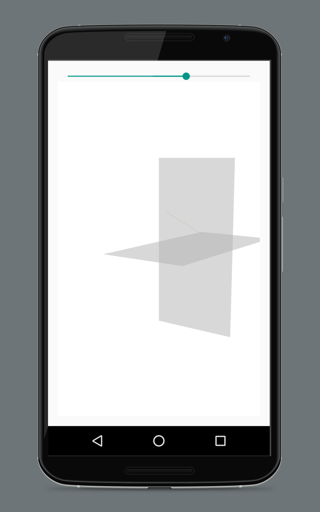
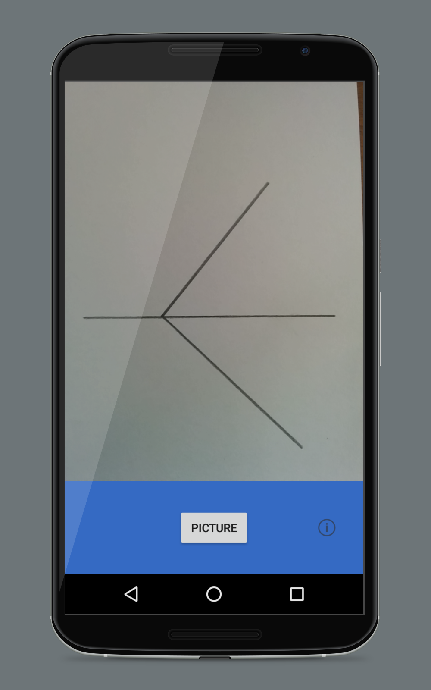
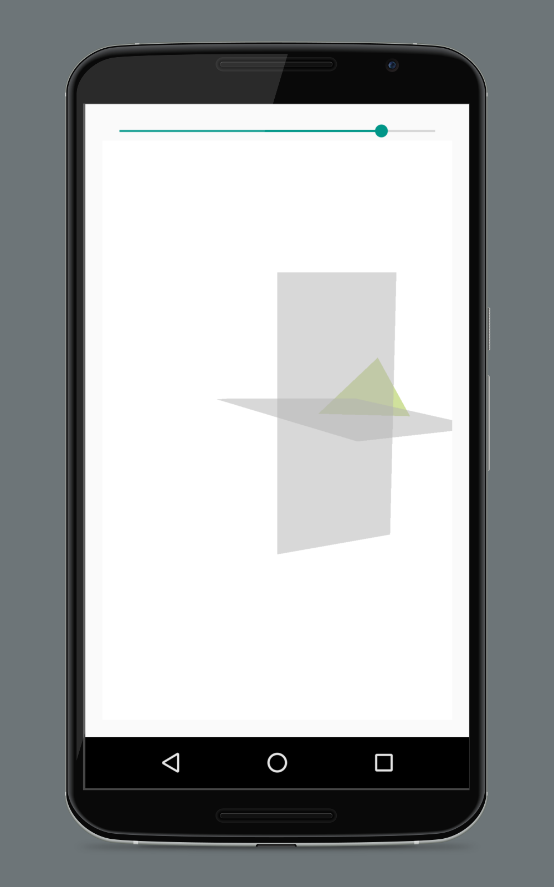
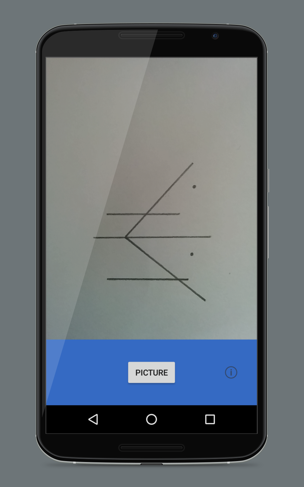
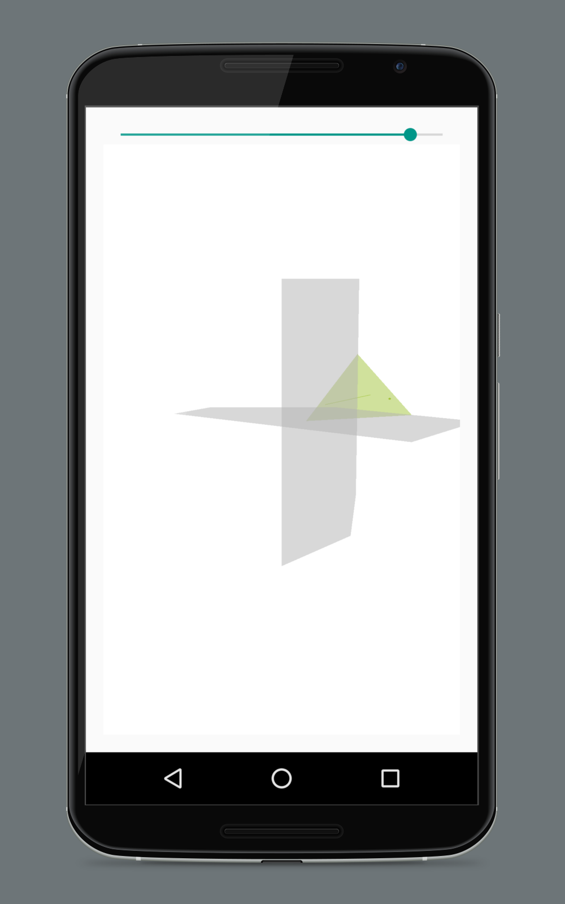

# DiedricoApp
DiedricoApp is a application for android devices (lollipop or earler). This app pass the exercises of descriptive geometry (in spanish Diedrico) to 3d. To use it, you have to take a picture of the exercise and especify what is in the picture, then you can view on 3D.

## Screenshots

  
   
 
 

## Why?
The objective of this tool is to help the students to understand more easily how descriptive geometry works and developing the 	shape recognition.

##What can i do with it?
DiedricoApp has support for points, lines and planes, in other words, in thery you can view en 3d any exercise of descriptive geometry.
With this tool you can experiment, view and learn while you are touching and creating!

##How does it work?
The app consist of a few main classes:
  *Camera2BasicFragment is the class for take a picture with the camera
  *PeviewMenuActivity is the menu activity
  *LineSegment is where we scan the interesting points and lines with BoofCV
  *OpenGlActivity is where we pass the data for representing in 3D with OpenGL

##Can I contribute?
Yes, of course.

##Contributors
DiedricoApp was written by:
* Fran Acién (acien101)
(View CREDITS for a more complete list)

##Libraries used
For this proyect I used [BoofCV](https://github.com/lessthanoptimal/BoofCV) and [OpenGL ES](http://developer.android.com/intl/es/guide/topics/graphics/opengl.html).

##License
This work is licensed under the terms of the GNU General Public License, version 2 or later (see
http://www.fsf.org/licensing/licenses/gpl.html). Derivative works and later
versions of the code must be free software licensed under the same or a
compatible license.
